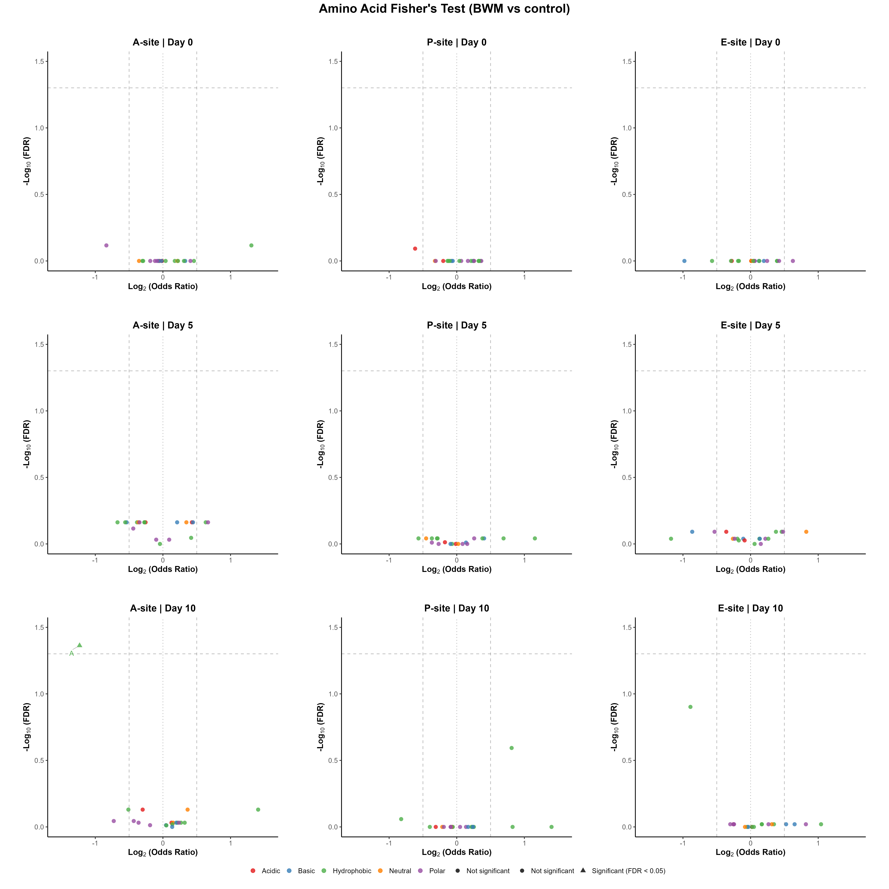
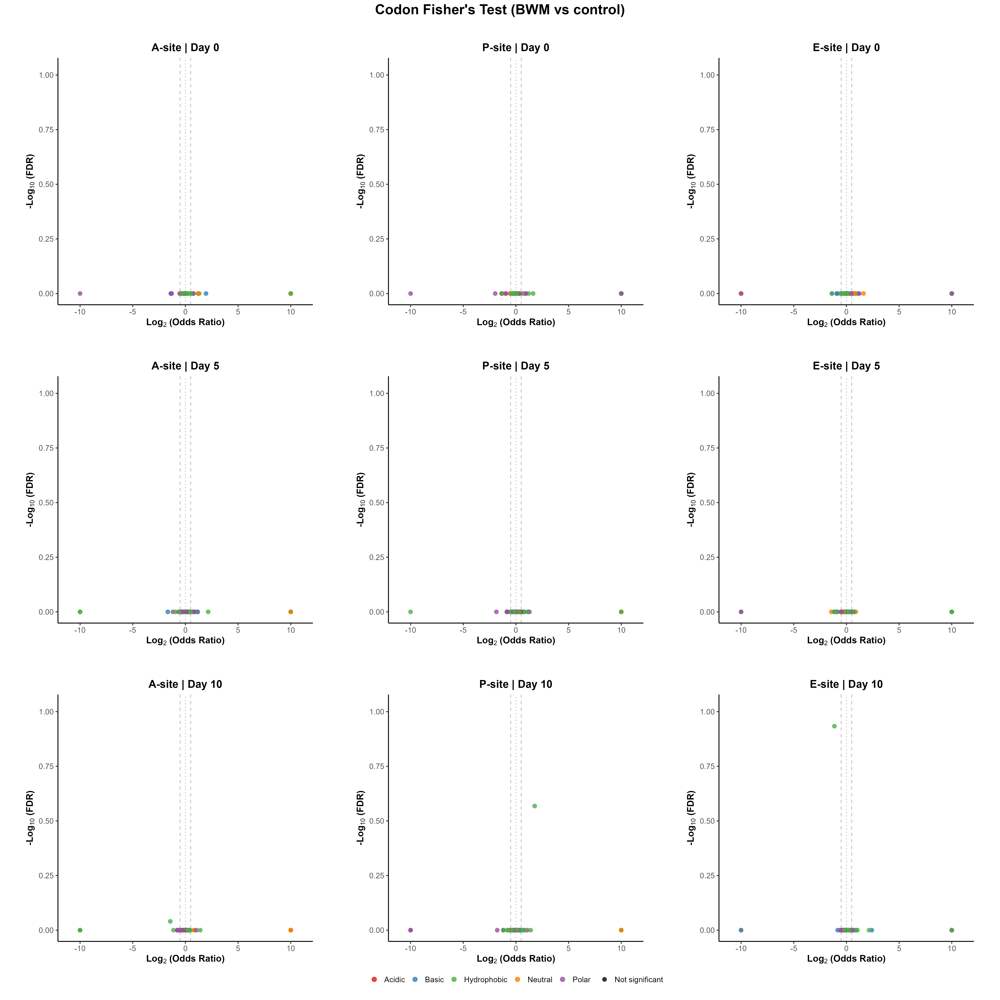

# Per-Timepoint Fisher's Exact (A3)

**Pipeline:** stall_sites_consensus_intersection (C. elegans)
**Test:** Fisher's exact test (two-sided), BWM vs control, at each timepoint independently, per E/P/A site (`ribostall.stats_core.fisher_row`, wrapped by `ribostall.enrichment.per_timepoint_fisher`). Null hypothesis: feature frequency at the stall site is independent of condition. Positive log2(odds ratio) favors BWM. Fisher's exact is a fair between-condition comparison here because the *intersection* transcript filtering gives every condition the same transcript universe, so raw stall-site shares are directly comparable.
**Source data:** `analysis/per_timepoint_fisher_aa.csv`, `analysis/per_timepoint_fisher_codon.csv`

## Key Data — Amino Acid level

- Tests run: **180** · Significant (p_adj < 0.05): **1** (0.6%)
- Direction split (significant only): **0** favor **BWM**, **1** favor **control**

**Most significant (top 10 by p_adj)**

| Site | Timepoint | Feature | log2(OR) | Odds ratio | p_value | p_adj | BWM | control | Flags |
|---|---|---|---|---|---|---|---|---|---|
| A | day_10 | A | -1.232 | 0.426 | 0.00217 | 0.0433 | 20/833 | 40/732 | low-count |
| E | day_10 | I | -0.889 | 0.540 | 0.00626 | 0.125 | 35/833 | 55/732 | low-count |
| P | day_10 | V | 0.812 | 1.755 | 0.0128 | 0.255 | 60/833 | 31/732 | low-count |
| A | day_5 | L | 0.633 | 1.551 | 0.0873 | 0.688 | 41/671 | 30/745 | low-count |
| A | day_5 | D | 0.428 | 1.346 | 0.127 | 0.688 | 65/671 | 55/745 |  |
| A | day_5 | R | 0.445 | 1.361 | 0.145 | 0.688 | 54/671 | 45/745 | low-count |
| A | day_5 | F | -0.672 | 0.628 | 0.22 | 0.688 | 12/671 | 21/745 | low-count |
| A | day_5 | G | -0.362 | 0.778 | 0.23 | 0.688 | 45/671 | 63/745 | low-count |
| A | day_5 | Q | 0.667 | 1.588 | 0.261 | 0.688 | 17/671 | 12/745 | low-count |
| A | day_5 | K | 0.210 | 1.157 | 0.314 | 0.688 | 116/671 | 114/745 |  |

**Largest effect (top 10 by \|effect\|, all rows)**

| Site | Timepoint | Feature | log2(OR) | Odds ratio | p_value | p_adj | BWM | control | Flags |
|---|---|---|---|---|---|---|---|---|---|
| A | day_10 | W | 1.408 | 2.654 | 0.155 | 0.741 | 9/833 | 3/732 | low-count |
| P | day_10 | W | 1.402 | 2.642 | 0.628 | 1 | 3/833 | 1/732 | low-count |
| A | day_0 | M | 1.308 | 2.476 | 0.0651 | 0.764 | 19/785 | 6/605 | low-count |
| A | day_10 | A | -1.232 | 0.426 | 0.00217 | 0.0433 | 20/833 | 40/732 | low-count |
| E | day_5 | W | -1.176 | 0.442 | 0.456 | 0.914 | 2/671 | 5/745 | low-count |
| P | day_5 | W | 1.156 | 2.228 | 0.431 | 0.909 | 4/671 | 2/745 | low-count |
| E | day_10 | W | 1.042 | 2.059 | 0.352 | 0.955 | 7/833 | 3/732 | low-count |
| E | day_0 | H | -0.978 | 0.508 | 0.106 | 1 | 10/785 | 15/605 | low-count |
| E | day_10 | I | -0.889 | 0.540 | 0.00626 | 0.125 | 35/833 | 55/732 | low-count |
| E | day_5 | H | -0.863 | 0.550 | 0.216 | 0.81 | 8/671 | 16/745 | low-count |

## Key Data — Codon level

- Tests run: **549** · Significant (p_adj < 0.05): **0** (0.0%)
- Direction split (significant only): **0** favor **BWM**, **0** favor **control**

**Most significant (top 10 by p_adj)**

| Site | Timepoint | Feature | log2(OR) | Odds ratio | p_value | p_adj | BWM | control | Flags |
|---|---|---|---|---|---|---|---|---|---|
| E | day_10 | ATC | -1.143 | 0.453 | 0.00191 | 0.117 | 24/833 | 45/732 | low-count |
| P | day_10 | GTC | 1.781 | 3.436 | 0.00443 | 0.27 | 23/833 | 6/732 | low-count |
| A | day_10 | GCC | -1.435 | 0.370 | 0.0149 | 0.911 | 9/833 | 21/732 | low-count |
| P | day_0 | GAA | -1.318 | 0.401 | 0.0277 | 1 | 9/785 | 17/605 | low-count |
| A | day_0 | ACC | -1.304 | 0.405 | 0.0539 | 1 | 8/785 | 15/605 | low-count |
| A | day_10 | GCT | -1.133 | 0.456 | 0.0586 | 1 | 10/833 | 19/732 | low-count |
| A | day_0 | ATG | 1.308 | 2.476 | 0.0651 | 1 | 19/785 | 6/605 | low-count |
| P | day_10 | TAC | -0.823 | 0.565 | 0.1 | 1 | 15/833 | 23/732 | low-count |
| P | day_5 | AAT | 1.283 | 2.433 | 0.103 | 1 | 13/671 | 6/745 | low-count |
| A | day_10 | GAG | -0.420 | 0.747 | 0.12 | 1 | 61/833 | 70/732 |  |

**Largest effect (top 10 by \|effect\|, all rows)**

| Site | Timepoint | Feature | log2(OR) | Odds ratio | p_value | p_adj | BWM | control | Flags |
|---|---|---|---|---|---|---|---|---|---|
| E | day_10 | CAT | 2.407 | 5.304 | 0.13 | 1 | 6/833 | 1/732 | low-count |
| A | day_5 | CTG | 2.158 | 4.462 | 0.196 | 1 | 4/671 | 1/745 | low-count |
| E | day_10 | GTG | 2.142 | 4.414 | 0.224 | 1 | 5/833 | 1/732 | low-count |
| P | day_0 | ACA | -1.966 | 0.256 | 0.323 | 1 | 1/785 | 3/605 | low-count |
| A | day_0 | CAT | 1.953 | 3.872 | 0.241 | 1 | 5/785 | 1/605 | low-count |
| P | day_5 | CAG | -1.855 | 0.276 | 0.378 | 1 | 1/671 | 4/745 | low-count |
| P | day_10 | GTC | 1.781 | 3.436 | 0.00443 | 0.27 | 23/833 | 6/732 | low-count |
| P | day_10 | TCG | -1.776 | 0.292 | 0.345 | 1 | 1/833 | 3/732 | low-count |
| A | day_5 | CAT | -1.666 | 0.315 | 0.184 | 1 | 2/671 | 7/745 | low-count |
| E | day_0 | CCC | 1.629 | 3.093 | 0.395 | 1 | 4/785 | 1/605 | low-count |

_122 row(s) have a fully separated 2x2 table (one arm's count is 0), giving an undefined/infinite odds ratio; excluded from the table above and always low-count-flagged._

## Plots

**Amino Acid composites**

Individual amino acid plots (9 files, not embedded): [`../plots/per_timepoint_fisher/individual`](../plots/per_timepoint_fisher/individual)

**Codon composites**

Individual codon plots (9 files, not embedded): [`../plots/per_timepoint_fisher/codon/individual`](../plots/per_timepoint_fisher/codon/individual)

## Key Points

<!-- KEY_POINTS_START -->
_TODO: hand-authored interpretation goes here (Stage 2)._
<!-- KEY_POINTS_END -->

## Caveats

- **FDR grouping:** p-values are Benjamini-Hochberg corrected per (timepoint, site) — a row's `p_adj` is only comparable to other rows sharing that grouping.
- **Low-count threshold:** rows flagged `low-count` have a raw feature count below 50; treat their effect sizes as less reliable.

---
_Key Data, Plots, and Caveats are auto-generated by `result_interpretation_scripts/extract_key_data.py`
from `analysis/*.csv` and will be overwritten on the next run. Only the Key Points section (between
the KEY_POINTS markers above) is hand-authored and preserved across regenerations._
