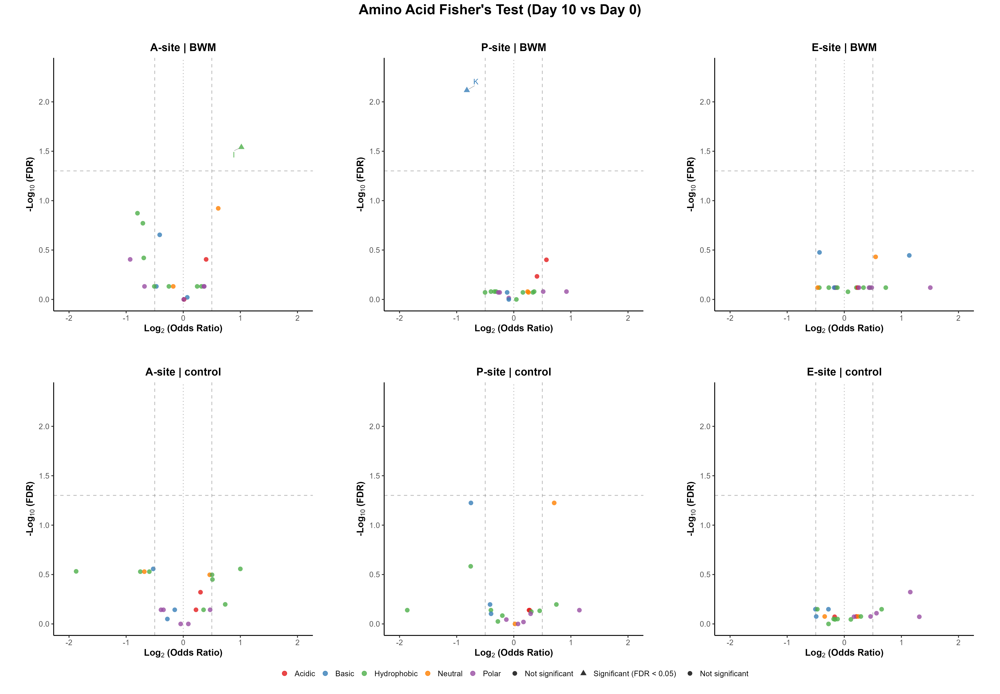
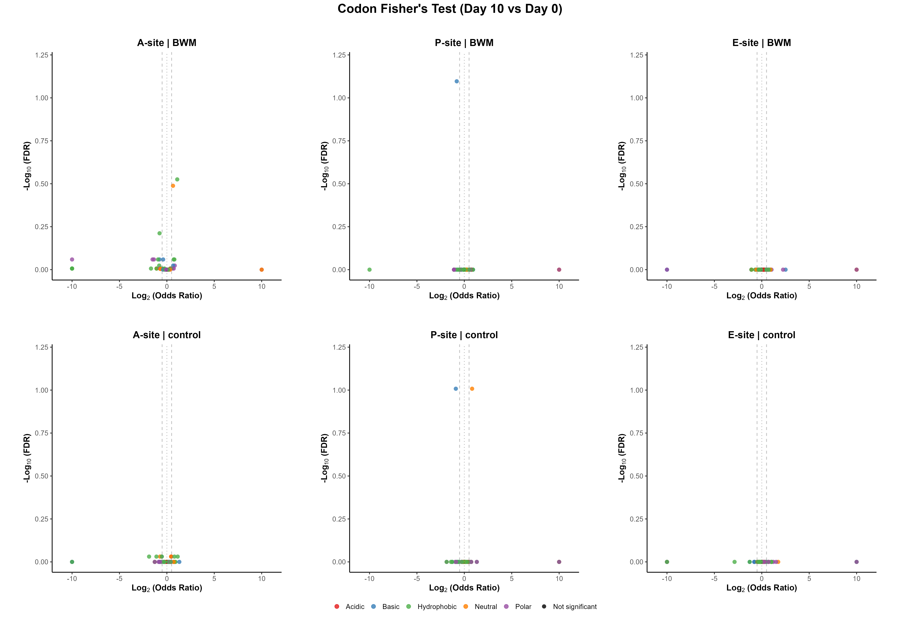

# Timepoint Fisher's Exact Within Condition — day 10 vs day 0 (A6)

**Pipeline:** stall_sites_consensus_intersection (C. elegans)
**Test:** Fisher's exact test (two-sided), day_10 vs day_0, within each condition independently, per E/P/A site (`ribostall.enrichment.between_timepoint_fisher_within_condition`). Null hypothesis: feature frequency at the stall site is independent of timepoint, holding condition fixed. Positive log2(odds ratio) favors the later timepoint (day_10). Fair under the *intersection* design for the same reason as the per-timepoint comparison.
**Source data:** `analysis/timepoint_fisher_within_condition_d10_vs_d0_aa.csv`, `analysis/timepoint_fisher_within_condition_d10_vs_d0_codon.csv`

## Key Data — Amino Acid level

- Tests run: **120** · Significant (p_adj < 0.05): **2** (1.7%)
- Direction split (significant only): **1** favor **day_10**, **1** favor **day_0**

**Most significant (top 10 by p_adj)**

| Site | Condition | Feature | log2(OR) | Odds ratio | p_value | p_adj | day_10 | day_0 | Flags |
|---|---|---|---|---|---|---|---|---|---|
| P | BWM | K | -0.822 | 0.566 | 0.000382 | 0.00764 | 71/833 | 111/785 |  |
| A | BWM | I | 1.017 | 2.024 | 0.00144 | 0.0288 | 64/833 | 31/785 | low-count |
| P | control | K | -0.750 | 0.594 | 0.00536 | 0.0596 | 56/732 | 74/605 |  |
| P | control | G | 0.708 | 1.633 | 0.00596 | 0.0596 | 101/732 | 54/605 |  |
| A | BWM | G | 0.612 | 1.529 | 0.012 | 0.12 | 104/833 | 67/785 |  |
| A | BWM | Y | -0.802 | 0.574 | 0.0201 | 0.134 | 30/833 | 48/785 | low-count |
| A | BWM | L | -0.707 | 0.612 | 0.0339 | 0.169 | 34/833 | 51/785 | low-count |
| A | BWM | K | -0.413 | 0.751 | 0.0555 | 0.222 | 96/833 | 116/785 |  |
| P | control | V | -0.754 | 0.593 | 0.0392 | 0.261 | 31/732 | 42/605 | low-count |
| A | control | A | 1.000 | 1.999 | 0.0202 | 0.277 | 40/732 | 17/605 | low-count |

**Largest effect (top 10 by \|effect\|, all rows)**

| Site | Condition | Feature | log2(OR) | Odds ratio | p_value | p_adj | day_10 | day_0 | Flags |
|---|---|---|---|---|---|---|---|---|---|
| A | control | W | -1.876 | 0.273 | 0.044 | 0.294 | 3/732 | 9/605 | low-count |
| P | control | W | -1.865 | 0.275 | 0.334 | 0.726 | 1/732 | 3/605 | low-count |
| E | BWM | C | 1.506 | 2.840 | 0.29 | 0.759 | 6/833 | 2/785 | low-count |
| E | control | C | 1.314 | 2.486 | 0.631 | 0.846 | 3/732 | 1/605 | low-count |
| E | control | Q | 1.155 | 2.228 | 0.0238 | 0.476 | 29/732 | 11/605 | low-count |
| P | control | C | 1.149 | 2.217 | 0.363 | 0.726 | 8/732 | 3/605 | low-count |
| E | BWM | H | 1.138 | 2.201 | 0.0358 | 0.358 | 23/833 | 10/785 | low-count |
| A | BWM | I | 1.017 | 2.024 | 0.00144 | 0.0288 | 64/833 | 31/785 | low-count |
| A | control | A | 1.000 | 1.999 | 0.0202 | 0.277 | 40/732 | 17/605 | low-count |
| A | BWM | Q | -0.930 | 0.525 | 0.157 | 0.393 | 9/833 | 16/785 | low-count |

## Key Data — Codon level

- Tests run: **366** · Significant (p_adj < 0.05): **0** (0.0%)
- Direction split (significant only): **0** favor **day_10**, **0** favor **day_0**

**Most significant (top 10 by p_adj)**

| Site | Condition | Feature | log2(OR) | Odds ratio | p_value | p_adj | day_10 | day_0 | Flags |
|---|---|---|---|---|---|---|---|---|---|
| P | BWM | AAG | -0.801 | 0.574 | 0.00131 | 0.0801 | 61/833 | 95/785 |  |
| P | control | AAG | -0.897 | 0.537 | 0.00303 | 0.0982 | 43/732 | 63/605 | low-count |
| P | control | GGA | 0.819 | 1.765 | 0.00322 | 0.0982 | 89/732 | 44/605 | low-count |
| A | BWM | ATC | 1.093 | 2.133 | 0.00489 | 0.298 | 44/833 | 20/785 | low-count |
| A | BWM | GGA | 0.646 | 1.565 | 0.0107 | 0.325 | 94/833 | 59/785 |  |
| A | BWM | TAC | -0.772 | 0.586 | 0.0302 | 0.614 | 28/833 | 44/785 | low-count |
| A | BWM | AAG | -0.392 | 0.762 | 0.0833 | 0.872 | 92/833 | 110/785 |  |
| A | BWM | CAA | -1.362 | 0.389 | 0.0871 | 0.872 | 5/833 | 12/785 | low-count |
| A | BWM | AGA | -0.782 | 0.581 | 0.107 | 0.872 | 15/833 | 24/785 | low-count |
| A | BWM | ACA | -inf | 0.000 | 0.114 | 0.872 | 0/833 | 3/785 | low-count |

**Largest effect (top 10 by \|effect\|, all rows)**

| Site | Condition | Feature | log2(OR) | Odds ratio | p_value | p_adj | day_10 | day_0 | Flags |
|---|---|---|---|---|---|---|---|---|---|
| E | control | GTG | -2.872 | 0.137 | 0.051 | 1 | 1/732 | 6/605 | low-count |
| E | BWM | CAT | 2.508 | 5.688 | 0.125 | 1 | 6/833 | 1/785 | low-count |
| E | BWM | TGC | 2.243 | 4.734 | 0.219 | 1 | 5/833 | 1/785 | low-count |
| A | control | TGG | -1.876 | 0.273 | 0.044 | 0.931 | 3/732 | 9/605 | low-count |
| P | control | ACA | -1.865 | 0.275 | 0.334 | 1 | 1/732 | 3/605 | low-count |
| P | control | TGG | -1.865 | 0.275 | 0.334 | 1 | 1/732 | 3/605 | low-count |
| E | control | GGC | 1.731 | 3.319 | 0.385 | 1 | 4/732 | 1/605 | low-count |
| A | BWM | CTG | -1.674 | 0.313 | 0.36 | 0.985 | 1/833 | 3/785 | low-count |
| E | control | TCC | 1.513 | 2.853 | 0.0495 | 1 | 17/732 | 5/605 | low-count |
| A | BWM | TCG | -1.510 | 0.351 | 0.135 | 0.872 | 3/833 | 8/785 | low-count |

_76 row(s) have a fully separated 2x2 table (one arm's count is 0), giving an undefined/infinite odds ratio; excluded from the table above and always low-count-flagged._

## Plots

**Amino Acid composites**

Individual amino acid plots (6 files, not embedded): [`../plots/within_condition_timepoint_fisher/d10_vs_d0/individual`](../plots/within_condition_timepoint_fisher/d10_vs_d0/individual)

**Codon composites**

Individual codon plots (6 files, not embedded): [`../plots/within_condition_timepoint_fisher/d10_vs_d0/codon/individual`](../plots/within_condition_timepoint_fisher/d10_vs_d0/codon/individual)

## Key Points

<!-- KEY_POINTS_START -->
_TODO: hand-authored interpretation goes here (Stage 2)._
<!-- KEY_POINTS_END -->

## Caveats

- **FDR grouping:** p-values are Benjamini-Hochberg corrected per (condition, site) — a row's `p_adj` is only comparable to other rows sharing that grouping.
- **Low-count threshold:** rows flagged `low-count` have a raw feature count below 50; treat their effect sizes as less reliable.

---
_Key Data, Plots, and Caveats are auto-generated by `result_interpretation_scripts/extract_key_data.py`
from `analysis/*.csv` and will be overwritten on the next run. Only the Key Points section (between
the KEY_POINTS markers above) is hand-authored and preserved across regenerations._
