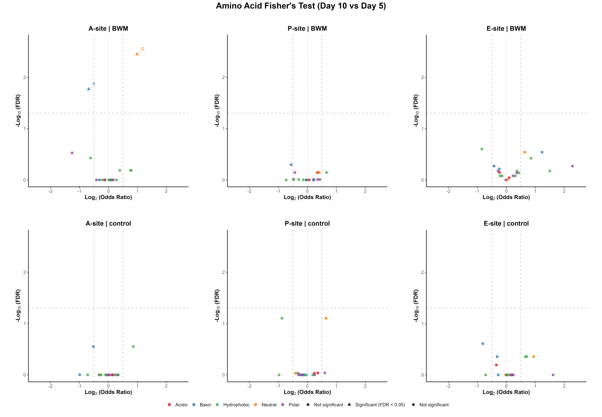
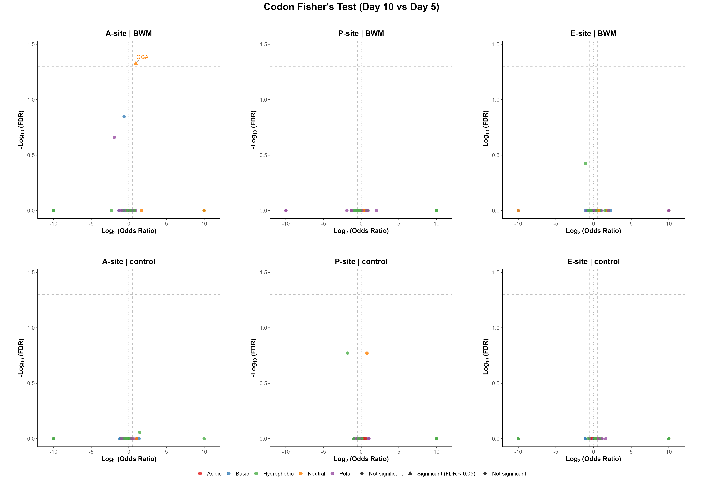

# Timepoint Fisher's Exact Within Condition — day 10 vs day 5 (A6)

**Pipeline:** stall_sites_consensus_intersection (C. elegans)
**Test:** Fisher's exact test (two-sided), day_10 vs day_5, within each condition independently, per E/P/A site (`ribostall.enrichment.between_timepoint_fisher_within_condition`). Null hypothesis: feature frequency at the stall site is independent of timepoint, holding condition fixed. Positive log2(odds ratio) favors the later timepoint (day_10). Fair under the *intersection* design for the same reason as the per-timepoint comparison.
**Source data:** `analysis/timepoint_fisher_within_condition_d10_vs_d5_aa.csv`, `analysis/timepoint_fisher_within_condition_d10_vs_d5_codon.csv`

## Key Data — Amino Acid level

- Tests run: **120** · Significant (p_adj < 0.05): **2** (1.7%)
- Direction split (significant only): **1** favor **day_10**, **1** favor **day_5**

**Most significant (top 10 by p_adj)**

| Site | Condition | Feature | log2(OR) | Odds ratio | p_value | p_adj | day_10 | day_5 | Flags |
|---|---|---|---|---|---|---|---|---|---|
| A | BWM | G | 0.989 | 1.985 | 0.000178 | 0.00356 | 104/833 | 45/671 | low-count |
| A | BWM | K | -0.682 | 0.623 | 0.0017 | 0.017 | 96/833 | 116/671 |  |
| P | control | G | 0.649 | 1.568 | 0.00704 | 0.0788 | 101/732 | 69/745 |  |
| P | control | V | -0.878 | 0.544 | 0.00788 | 0.0788 | 31/732 | 56/745 | low-count |
| E | control | R | -0.811 | 0.570 | 0.0123 | 0.246 | 33/732 | 57/745 | low-count |
| E | BWM | I | -0.845 | 0.557 | 0.0125 | 0.251 | 35/833 | 49/671 | low-count |
| A | control | K | -0.518 | 0.698 | 0.0214 | 0.281 | 82/732 | 114/745 |  |
| A | control | A | 0.860 | 1.815 | 0.0281 | 0.281 | 40/732 | 23/745 | low-count |
| E | BWM | G | 0.634 | 1.552 | 0.0357 | 0.288 | 71/833 | 38/671 | low-count |
| E | BWM | H | 1.235 | 2.353 | 0.0432 | 0.288 | 23/833 | 8/671 | low-count |

**Largest effect (top 10 by \|effect\|, all rows)**

| Site | Condition | Feature | log2(OR) | Odds ratio | p_value | p_adj | day_10 | day_5 | Flags |
|---|---|---|---|---|---|---|---|---|---|
| E | BWM | C | 2.281 | 4.861 | 0.139 | 0.537 | 6/833 | 1/671 | low-count |
| E | control | C | 1.614 | 3.062 | 0.37 | 1 | 3/732 | 1/745 | low-count |
| E | BWM | W | 1.503 | 2.835 | 0.313 | 0.67 | 7/833 | 2/671 | low-count |
| A | BWM | Q | -1.251 | 0.420 | 0.0447 | 0.298 | 9/833 | 17/671 | low-count |
| E | BWM | H | 1.235 | 2.353 | 0.0432 | 0.288 | 23/833 | 8/671 | low-count |
| A | control | H | -0.990 | 0.503 | 0.149 | 0.991 | 8/732 | 16/745 | low-count |
| A | BWM | G | 0.989 | 1.985 | 0.000178 | 0.00356 | 104/833 | 45/671 | low-count |
| P | control | W | -0.977 | 0.508 | 1 | 1 | 1/732 | 2/745 | low-count |
| E | control | P | 0.943 | 1.923 | 0.0544 | 0.441 | 26/732 | 14/745 | low-count |
| P | control | V | -0.878 | 0.544 | 0.00788 | 0.0788 | 31/732 | 56/745 | low-count |

## Key Data — Codon level

- Tests run: **366** · Significant (p_adj < 0.05): **1** (0.3%)
- Direction split (significant only): **1** favor **day_10**, **0** favor **day_5**

**Most significant (top 10 by p_adj)**

| Site | Condition | Feature | log2(OR) | Odds ratio | p_value | p_adj | day_10 | day_5 | Flags |
|---|---|---|---|---|---|---|---|---|---|
| A | BWM | GGA | 0.930 | 1.905 | 0.000774 | 0.0472 | 94/833 | 42/671 | low-count |
| A | BWM | AAG | -0.628 | 0.647 | 0.00466 | 0.142 | 92/833 | 108/671 |  |
| P | control | GGA | 0.768 | 1.703 | 0.0029 | 0.169 | 89/732 | 56/745 |  |
| P | control | GTC | -1.811 | 0.285 | 0.00554 | 0.169 | 6/732 | 21/745 | low-count |
| A | BWM | CAA | -1.921 | 0.264 | 0.0107 | 0.218 | 5/833 | 15/671 | low-count |
| E | BWM | ATC | -1.057 | 0.481 | 0.00618 | 0.377 | 24/833 | 39/671 | low-count |
| A | control | GCC | 1.444 | 2.721 | 0.0144 | 0.877 | 21/732 | 8/745 | low-count |
| A | control | AAG | -0.460 | 0.727 | 0.0484 | 0.997 | 78/732 | 105/745 |  |
| A | control | CGC | 1.366 | 2.577 | 0.049 | 0.997 | 15/732 | 6/745 | low-count |
| E | control | AGA | -1.101 | 0.466 | 0.017 | 1 | 15/732 | 32/745 | low-count |

**Largest effect (top 10 by \|effect\|, all rows)**

| Site | Condition | Feature | log2(OR) | Odds ratio | p_value | p_adj | day_10 | day_5 | Flags |
|---|---|---|---|---|---|---|---|---|---|
| A | BWM | CTG | -2.319 | 0.200 | 0.179 | 1 | 1/833 | 4/671 | low-count |
| E | BWM | CAT | 2.281 | 4.861 | 0.139 | 1 | 6/833 | 1/671 | low-count |
| E | BWM | GTG | 2.016 | 4.046 | 0.234 | 1 | 5/833 | 1/671 | low-count |
| P | BWM | CAG | 2.016 | 4.046 | 0.234 | 1 | 5/833 | 1/671 | low-count |
| E | BWM | TGC | 2.016 | 4.046 | 0.234 | 1 | 5/833 | 1/671 | low-count |
| A | BWM | CAA | -1.921 | 0.264 | 0.0107 | 0.218 | 5/833 | 15/671 | low-count |
| P | BWM | TCG | -1.902 | 0.268 | 0.33 | 1 | 1/833 | 3/671 | low-count |
| P | control | GTC | -1.811 | 0.285 | 0.00554 | 0.169 | 6/732 | 21/745 | low-count |
| A | BWM | GGT | 1.698 | 3.244 | 0.2 | 1 | 8/833 | 2/671 | low-count |
| E | BWM | GCA | 1.693 | 3.233 | 0.389 | 1 | 4/833 | 1/671 | low-count |

_82 row(s) have a fully separated 2x2 table (one arm's count is 0), giving an undefined/infinite odds ratio; excluded from the table above and always low-count-flagged._

## Plots

**Amino Acid composites**

Individual amino acid plots (6 files, not embedded): [`../plots/within_condition_timepoint_fisher/d10_vs_d5/individual`](../plots/within_condition_timepoint_fisher/d10_vs_d5/individual)

**Codon composites**

Individual codon plots (6 files, not embedded): [`../plots/within_condition_timepoint_fisher/d10_vs_d5/codon/individual`](../plots/within_condition_timepoint_fisher/d10_vs_d5/codon/individual)

## Key Points

<!-- KEY_POINTS_START -->
_TODO: hand-authored interpretation goes here (Stage 2)._
<!-- KEY_POINTS_END -->

## Caveats

- **FDR grouping:** p-values are Benjamini-Hochberg corrected per (condition, site) — a row's `p_adj` is only comparable to other rows sharing that grouping.
- **Low-count threshold:** rows flagged `low-count` have a raw feature count below 50; treat their effect sizes as less reliable.

---
_Key Data, Plots, and Caveats are auto-generated by `result_interpretation_scripts/extract_key_data.py`
from `analysis/*.csv` and will be overwritten on the next run. Only the Key Points section (between
the KEY_POINTS markers above) is hand-authored and preserved across regenerations._
