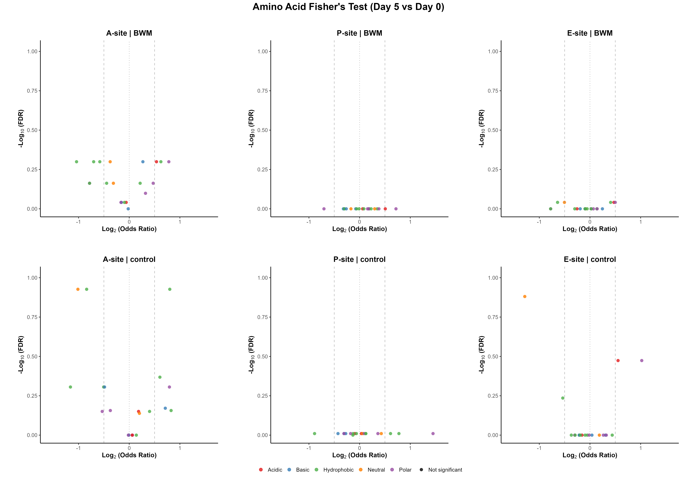
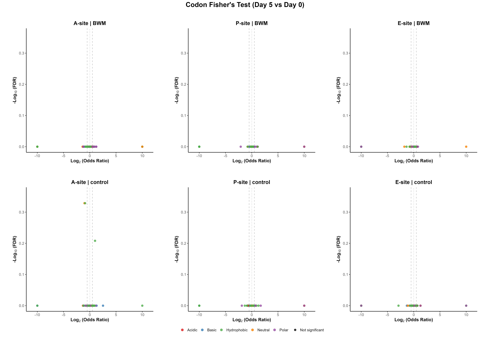

# Timepoint Fisher's Exact Within Condition — day 5 vs day 0 (A6)

**Pipeline:** stall_sites_consensus_intersection (C. elegans)
**Test:** Fisher's exact test (two-sided), day_5 vs day_0, within each condition independently, per E/P/A site (`ribostall.enrichment.between_timepoint_fisher_within_condition`). Null hypothesis: feature frequency at the stall site is independent of timepoint, holding condition fixed. Positive log2(odds ratio) favors the later timepoint (day_5). Fair under the *intersection* design for the same reason as the per-timepoint comparison.
**Source data:** `analysis/timepoint_fisher_within_condition_d5_vs_d0_aa.csv`, `analysis/timepoint_fisher_within_condition_d5_vs_d0_codon.csv`

## Key Data — Amino Acid level

- Tests run: **120** · Significant (p_adj < 0.05): **0** (0.0%)
- Direction split (significant only): **0** favor **day_5**, **0** favor **day_0**

**Most significant (top 10 by p_adj)**

| Site | Condition | Feature | log2(OR) | Odds ratio | p_value | p_adj | day_5 | day_0 | Flags |
|---|---|---|---|---|---|---|---|---|---|
| A | control | V | 0.800 | 1.742 | 0.0102 | 0.118 | 70/745 | 34/605 | low-count |
| A | control | P | -1.013 | 0.496 | 0.0137 | 0.118 | 22/745 | 35/605 | low-count |
| A | control | Y | -0.840 | 0.559 | 0.0178 | 0.118 | 32/745 | 45/605 | low-count |
| E | control | P | -1.286 | 0.410 | 0.00658 | 0.132 | 14/745 | 27/605 | low-count |
| E | control | Q | 1.022 | 2.031 | 0.0483 | 0.336 | 27/745 | 11/605 | low-count |
| E | control | E | 0.554 | 1.468 | 0.0504 | 0.336 | 82/745 | 47/605 | low-count |
| A | control | I | 0.605 | 1.521 | 0.0857 | 0.428 | 53/745 | 29/605 | low-count |
| A | control | R | -0.487 | 0.714 | 0.134 | 0.495 | 45/745 | 50/605 | low-count |
| A | control | W | -1.160 | 0.447 | 0.179 | 0.495 | 5/745 | 9/605 | low-count |
| A | control | N | 0.793 | 1.733 | 0.185 | 0.495 | 19/745 | 9/605 | low-count |

**Largest effect (top 10 by \|effect\|, all rows)**

| Site | Condition | Feature | log2(OR) | Odds ratio | p_value | p_adj | day_5 | day_0 | Flags |
|---|---|---|---|---|---|---|---|---|---|
| P | control | C | 1.449 | 2.730 | 0.161 | 0.977 | 10/745 | 3/605 | low-count |
| E | control | P | -1.286 | 0.410 | 0.00658 | 0.132 | 14/745 | 27/605 | low-count |
| A | control | W | -1.160 | 0.447 | 0.179 | 0.495 | 5/745 | 9/605 | low-count |
| A | BWM | M | -1.040 | 0.486 | 0.118 | 0.502 | 8/671 | 19/785 | low-count |
| E | control | Q | 1.022 | 2.031 | 0.0483 | 0.336 | 27/745 | 11/605 | low-count |
| A | control | P | -1.013 | 0.496 | 0.0137 | 0.118 | 22/745 | 35/605 | low-count |
| P | control | W | -0.889 | 0.540 | 0.662 | 0.977 | 2/745 | 3/605 | low-count |
| A | control | Y | -0.840 | 0.559 | 0.0178 | 0.118 | 32/745 | 45/605 | low-count |
| A | control | M | 0.826 | 1.773 | 0.353 | 0.698 | 13/745 | 6/605 | low-count |
| A | control | V | 0.800 | 1.742 | 0.0102 | 0.118 | 70/745 | 34/605 | low-count |

## Key Data — Codon level

- Tests run: **366** · Significant (p_adj < 0.05): **0** (0.0%)
- Direction split (significant only): **0** favor **day_5**, **0** favor **day_0**

**Most significant (top 10 by p_adj)**

| Site | Condition | Feature | log2(OR) | Odds ratio | p_value | p_adj | day_5 | day_0 | Flags |
|---|---|---|---|---|---|---|---|---|---|
| A | control | TAC | -0.896 | 0.537 | 0.0131 | 0.469 | 28/745 | 41/605 | low-count |
| A | control | CCA | -1.018 | 0.494 | 0.0154 | 0.469 | 20/745 | 32/605 | low-count |
| A | control | GTC | 0.998 | 1.997 | 0.0305 | 0.619 | 36/745 | 15/605 | low-count |
| E | control | CCA | -1.109 | 0.464 | 0.0302 | 1 | 14/745 | 24/605 | low-count |
| E | control | GTG | -2.898 | 0.134 | 0.05 | 1 | 1/745 | 6/605 | low-count |
| P | BWM | TTG | 1.095 | 2.136 | 0.0568 | 1 | 18/671 | 10/785 | low-count |
| E | control | GAG | 0.623 | 1.540 | 0.0633 | 1 | 59/745 | 32/605 | low-count |
| A | control | CAT | 2.518 | 5.729 | 0.0813 | 1 | 7/745 | 1/605 | low-count |
| P | control | ATT | -1.318 | 0.401 | 0.0923 | 1 | 6/745 | 12/605 | low-count |
| P | control | TAC | 0.894 | 1.858 | 0.101 | 1 | 27/745 | 12/605 | low-count |

**Largest effect (top 10 by \|effect\|, all rows)**

| Site | Condition | Feature | log2(OR) | Odds ratio | p_value | p_adj | day_5 | day_0 | Flags |
|---|---|---|---|---|---|---|---|---|---|
| E | control | GTG | -2.898 | 0.134 | 0.05 | 1 | 1/745 | 6/605 | low-count |
| A | control | CAT | 2.518 | 5.729 | 0.0813 | 1 | 7/745 | 1/605 | low-count |
| P | BWM | CAG | -2.103 | 0.233 | 0.226 | 1 | 1/671 | 5/785 | low-count |
| P | control | TCA | -1.891 | 0.270 | 0.331 | 1 | 1/745 | 3/605 | low-count |
| E | BWM | CCC | -1.779 | 0.291 | 0.382 | 1 | 1/671 | 4/785 | low-count |
| P | control | TGC | 1.710 | 3.273 | 0.2 | 1 | 8/745 | 2/605 | low-count |
| A | BWM | GGT | -1.365 | 0.388 | 0.3 | 1 | 2/671 | 6/785 | low-count |
| E | BWM | GTG | -1.362 | 0.389 | 0.629 | 1 | 1/671 | 3/785 | low-count |
| A | BWM | CCC | -1.362 | 0.389 | 0.629 | 1 | 1/671 | 3/785 | low-count |
| P | control | ATT | -1.318 | 0.401 | 0.0923 | 1 | 6/745 | 12/605 | low-count |

_81 row(s) have a fully separated 2x2 table (one arm's count is 0), giving an undefined/infinite odds ratio; excluded from the table above and always low-count-flagged._

## Plots

**Amino Acid composites**

Individual amino acid plots (6 files, not embedded): [`../plots/within_condition_timepoint_fisher/d5_vs_d0/individual`](../plots/within_condition_timepoint_fisher/d5_vs_d0/individual)

**Codon composites**

Individual codon plots (6 files, not embedded): [`../plots/within_condition_timepoint_fisher/d5_vs_d0/codon/individual`](../plots/within_condition_timepoint_fisher/d5_vs_d0/codon/individual)

## Key Points

<!-- KEY_POINTS_START -->
_TODO: hand-authored interpretation goes here (Stage 2)._
<!-- KEY_POINTS_END -->

## Caveats

- **FDR grouping:** p-values are Benjamini-Hochberg corrected per (condition, site) — a row's `p_adj` is only comparable to other rows sharing that grouping.
- **Low-count threshold:** rows flagged `low-count` have a raw feature count below 50; treat their effect sizes as less reliable.

---
_Key Data, Plots, and Caveats are auto-generated by `result_interpretation_scripts/extract_key_data.py`
from `analysis/*.csv` and will be overwritten on the next run. Only the Key Points section (between
the KEY_POINTS markers above) is hand-authored and preserved across regenerations._
